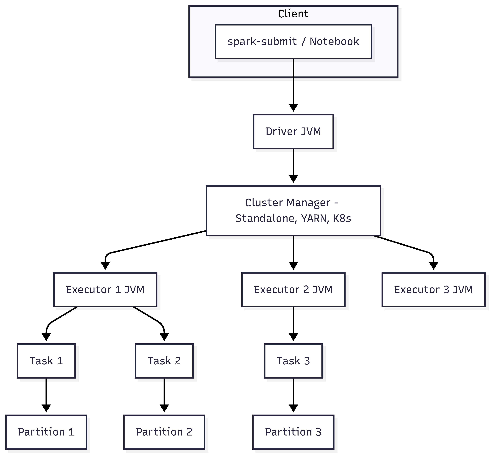
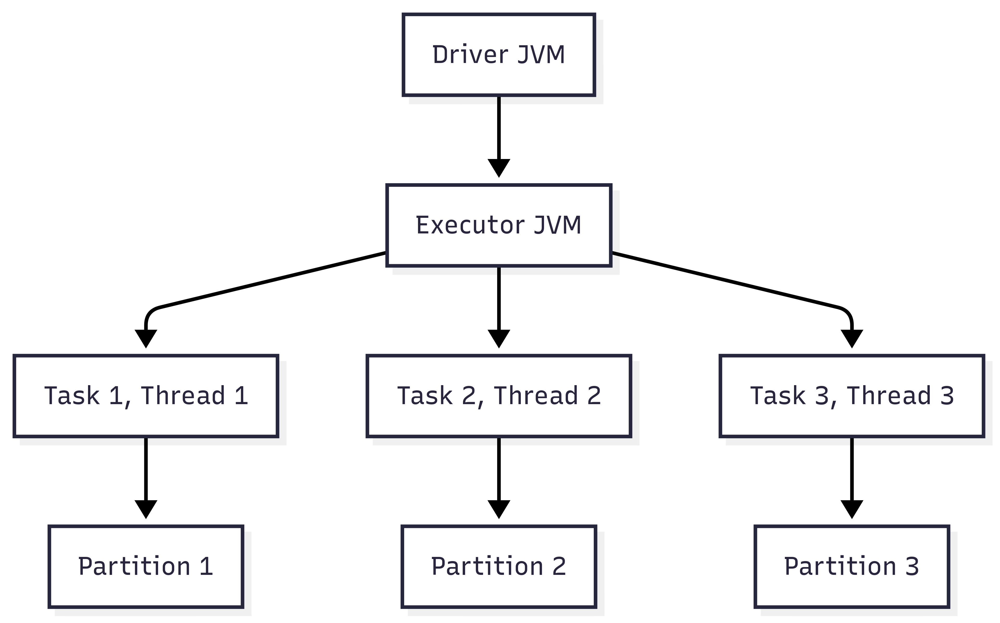
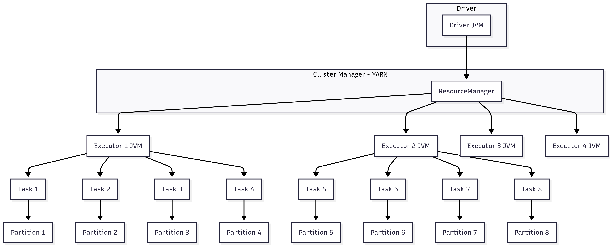
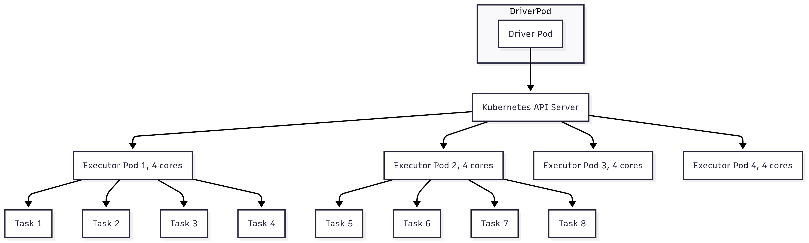

# 🔥 PySpark - Basic Exec Model & Resource
*(以 `spark.master=local[3]` 為例)*

---

本筆記涵蓋以下內容：

- Spark 程式執行方式
- Spark 運算架構與提交流程
- Spark 執行模式與 Cluster Manager
- Local 模式範例
- 基本資源調整建議

## Spark 程式執行方式

Spark 提供兩大類型的執行方式：**互動式開發**與**提交批次任務**。

### 互動式開發 (Interactive Clients) 🧪
適合開發與資料探索，快速測試程式與驗證邏輯。

| 工具 | 功能 | 適用場景 |
|------|------|-----------|
| **spark-shell** | Scala / Python / R REPL，快速測試 | 小型測試、學習 |
| **Notebook** | Jupyter、Zeppelin、Databricks Notebook | 資料探索、可視化分析 |

> **特點**：快速驗證邏輯，但**不適合長時間運行**或大規模計算。

---

### 提交批次任務 (Submit Job) 🚀
適合正式環境，將 Spark Job 提交給叢集運行。

| 工具 | 功能 | 適用場景 |
|------|------|-----------|
| **spark-submit** | 最常用方式，提交 Application 至叢集 | Prod ETL、批次處理 |
| **Databricks** | 雲端 Notebook 平台，內建 Spark 運行環境 | 雲端數據處理 |
| **REST API / Web UI** | 提交、監控、管理 Spark Job | 自動化調度 |

---

## Spark 運算架構與提交流程

Spark 採用 **Driver + Executor** 架構，透過 **Cluster Manager** 管理資源。

### 核心元件
| 元件 | 類型 | 功能 |
|------|------|------|
| **Client** | 提交端 | 提交 Job，例如 `spark-submit` |
| **Driver** | JVM Process | 任務調度中心，負責 Stage 分割與 Task 分配 |
| **Executor** | JVM Process | 執行 Tasks，負責計算資料 |
| **Task** | Thread | Executor 內執行的最小計算單位 |
| **Cluster Manager** | 資源管理器 | 分配叢集 CPU / Memory 資源，啟動 Executors |

---

### Spark Job 提交流程



---

## Spark 執行模式與 Cluster Manager

Spark 支援多種執行模式，決定 Driver 與 Executor 的運行位置。

| 模式 | spark.master 設定 | JVM Process 數量 | Thread 數量 | 適用場景 |
|------|--------------------|------------------|-------------|-----------|
| **Local[3]** | `local[3]` | 1 Driver + 1 Executor | 3 | 本機測試 / 模擬並行 |
| **Local[*]** | `local[*]` | 1 Driver + 1 Executor | CPU核心數 | 壓測或單機極限 |
| **Standalone** | `spark://host:7077` | 多 Executors | 多 Threads | Spark 原生叢集 |
| **YARN** | `yarn` | Container 決定 | 多 Threads | Hadoop 生態 |
| **Kubernetes** | `k8s://` | Pod 決定 | 多 Threads | 雲端原生 |
| **Mesos** | `mesos://` | 多 Executors | 多 Threads | 大型企業共享叢集 |

---

## Local 模式範例：spark.master=local[3]

### local[3] 運行架構圖



```text
- 1 Driver + 1 Executor JVM  
- Executor 內 3 Threads → 同時處理 3 Tasks  
- 若 12 Partitions → Spark 需分 4 輪執行
```

---

## YARN 模式架構圖



---

## Kubernetes 模式架構圖



---

## Spark 可嘗試資源配置策略

| 模式 | Driver 位置 | Executor JVM 數 | 每 Executor Threads | 最大併行度 | 適用場景 |
|------|------------|-----------------|---------------------|-----------|-----------|
| **local[3]** | 本機 | 1 | 3 | 3 | 小型測試 |
| **YARN** | ResourceManager | 4 | 4 | 16 | Hadoop 生態 |
| **K8s** | Pod | 4 | 4 | 16 | 雲端原生 |

**最大併行度公式：**
```text
Max Concurrent Tasks = Executors × Executor Cores
```

---

## Spark 一些調整建議

1. **Partition** 建議大小 ≈ 128MB  
2. **Executors × Cores** ≈ Partition 數 / 2~3  
3. **Shuffle Partition** = Executors × Cores × 2  
4. 避免單 Executor 過多 Threads → 降低 GC 負擔  
5. Production 建議開啟動態資源配置：  
```bash
--conf spark.dynamicAllocation.enabled=true
```

---

## 總結

- **local[3]** → 1 Executor JVM + 3 Threads → 適合開發與模擬並行  
- Production → 建議使用 **YARN / K8s / Standalone**  
- Spark 效能調優核心三步：
    1. 決定 Partition 數量
    2. 設定 Executors × Cores
    3. 調整 Shuffle Partitions

---

## Reference
[PySpark - Apache Spark Programming in Python for beginners](https://www.udemy.com/course/apache-spark-programming-in-python-for-beginners/)

---

最近打拳被揍到腦袋有點不靈光 🤕  
寫文章需要咖啡來補血 ☕  
如果你喜歡這篇內容，歡迎請我喝杯咖啡！  

Lately I’ve been punched a bit too much in boxing 🥊  
My brain runs on coffee patches ☕  
If you enjoyed this post, fuel me with a cup!  

👉 [Buy Me a Coffee](https://buymeacoffee.com/james604s)

---