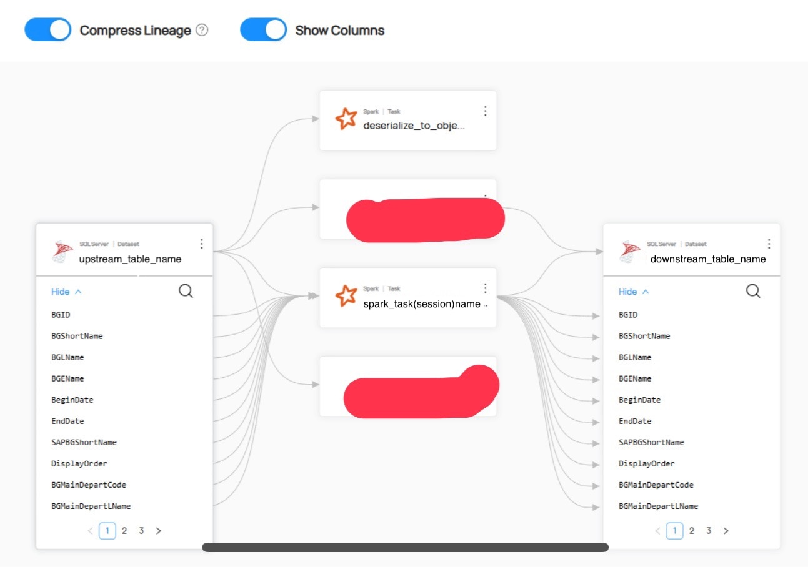

# PySpark Data Lineage with Datahub

在我們日常的資料工作中，一個最令人頭痛的問題莫過於：「這張報表的資料到底從哪裡來？中間經過了哪些處理？」當資料流程變得越來越複雜時，如果沒有清晰的**資料血緣 (Data Lineage)**，追蹤問題、評估變更影響，甚至確保資料的可信度，都會變成一場噩夢。

幸運的是，像 PySpark 這樣的強大處理引擎，搭配 Datahub 這樣的現代資料目錄 (Data Catalog)，可以幫助我們自動化地解開這個謎團。

*在 Datahub 中呈現的清晰資料血緣圖*

## **Spark & Lineage**

在我們動手寫任何程式碼之前，最重要的一步是理解這背後的「魔法」是如何運作的。PySpark 本身並不會主動告訴外界它的資料流向，那麼 Datahub 是如何得知的呢？

答案就在於 Spark 提供的一個強大機制：**SparkListener** 介面。

### **SparkListener：安插在 Spark 內的事件監聽器**

SparkListener 是 Spark 框架中基於觀察者模式 (Observer Pattern) 的一個實作。你可以把它想像成一個我們安插在 Spark 應用程式內部的「事件監聽器」。當你的 PySpark 腳本執行時，它內部的每一個重要動作——作業開始 (onJobStart)、作業結束 (onJobEnd)，乃至於一個查詢的執行 (onQueryExecution)——都會在 Spark 內部觸發一個對應的「事件」。

我們的血緣擷取工具，正是透過實作這個介面來監聽這些事件。其中，對於資料血緣來說，最重要的事件是 **onQueryExecution**。

### **Logical Plan：Spark 任務的原始設計藍圖**

當 onQueryExecution 事件被觸發時，監聽器會收到一個 QueryExecution 物件，這個物件中包含了我們擷取血緣的關鍵資訊：**邏輯計劃 (Logical Plan)**。

Logical Plan 是一個抽象語法樹 (Abstract Syntax Tree, AST)，它代表了你的 DataFrame 操作或 SQL 查詢在經過任何優化**之前**的完整結構。為什麼強調「未經優化」？因為它最忠實地反映了你編寫的程式碼邏輯。這個計畫詳細記錄了：

* **資料來源 (Sources)**：透過 UnresolvedRelation 等節點，標示資料是從哪個資料庫的哪張表讀取的。
* **轉換操作 (Transformations)**：透過 Project (對應 select 或 withColumn)、Filter、Join 等節點，描述資料經過的每一個處理步驟。
* **資料去向 (Sink)**：描述最終結果被寫入到哪個目的地。

血緣工具的核心任務，就是遞迴地遍歷這棵 Logical Plan 樹，解析出其中包含的輸入、輸出以及欄位級別的操作，從而完整地還原出資料的完整旅程。

**核心概念**：無論是 Datahub 的原生整合工具，還是 OpenLineage 的開放標準工具，它們的核心都是實現了一個 SparkListener。**它們的根本差異，不在於如何擷取 Logical Plan，而在於如何將解析後的血緣資訊「格式化」並「匯報」給 Datahub。**

## **ETL Example (部分由 Gemini 生成)**

理論講完了，讓我們來建立一個統一的實戰場景。以下是一個通用的 PySpark 腳本，它將是我們後續兩種方法的測試對象。

**任務目標**：從 MSSQL 的 dbo.source_table 讀取資料，進行一系列轉換，然後將結果寫入 dbo.target_table。

### process_mssql_data.py
```
from pyspark.sql import SparkSession
from pyspark.sql.functions import col, lit, current_timestamp, upper, year, month

def main():
 """
 一個從 MSSQL 讀取、轉換並寫入的 Spark ETL 作業。
 """
 spark = SparkSession.builder.appName("MSSQL_ETL_Lineage_Demo").getOrCreate()

    # db conn
    jdbc_url = "jdbc:sqlserver://your_mssql_server:1433;databaseName=your_db"
    connection_properties = {
        "user": "your_user",
        "password": "your_password",
        "driver": "com.microsoft.sqlserver.jdbc.SQLServerDriver"
    }
    source_table = "dbo.source_table"
    target_table = "dbo.target_table"

    # Read Table
    print("--- 正在從來源資料表讀取資料 ---")
    source_df = spark.read.jdbc(
        url=jdbc_url,
        table=source_table,
        properties=connection_properties
    )
    print("來源 DataFrame Schema:")
    source_df.printSchema()

    # Tranform

    print("--- 正在進行資料轉換 ---")
    transformed_df = source_df \
        .withColumn("processed_at", current_timestamp()) \
        .withColumn("job_name", lit("MSSQL_ETL_Lineage_Demo")) \
        .withColumn("source_system_upper", upper(col("source_system"))) \
        .withColumn("event_year", year(col("event_date"))) \
        .withColumn("event_month", month(col("event_date"))) \
        .filter(col("value") > 100)

    print("轉換後 DataFrame Schema:")
    transformed_df.printSchema()

    # Write

    print(f"--- 正在將資料寫入 {target_table} ---")
    transformed_df.write.jdbc(
        url=jdbc_url,
        table=target_table,
        mode="overwrite",
        properties=connection_properties
    )

    print("--- 作業成功完成！ ---")
    spark.stop()

if __name__ == "__main__":
    main()
```

現在，我們將用兩種不同的 spark-submit 指令來執行同一個腳本，看看它們是如何實現血緣追蹤的。

### **路徑 A：直達車 - Datahub 原生整合 (acryl-spark-lineage)**

這條路徑像是搭乘一班為 Datahub 量身打造的直達專車，簡單、快速，改造 OpenLineage 標準以符合 Datahub 的格式。

* **報告格式**：將 Logical Plan 直接翻譯成 Datahub 內部能理解的格式，稱為 **Metadata Change Proposals (MCPs)**。
* **報告機制**：透過 HTTP API 直接將這些 MCPs 發送給 Datahub 的核心服務 (GMS)。

> 確保你已經下載了 MSSQL JDBC 驅動
```
export MSSQL_JDBC_JAR="/path/to/mssql-jdbc.jar"  
```
**spark-submit 指令：**  
```
spark-submit \
    --master local[*] \
    --packages io.acryl:acryl-spark-lineage_2.12:0.2.18 \
    --jars ${MSSQL_JDBC_JAR} \
    --conf "spark.extraListeners=io.acryl.spark.AcrylSparkListener" \
    --conf "spark.datahub.url=http://your-datahub-gms-host:8080" \
    --conf "spark.datahub.token=YOUR_DATAHUB_API_TOKEN" \
```
```
process_mssql_data.py
```
* **spark.extraListeners**: 這是啟動魔法的關鍵，告訴 Spark 要掛載 Acryl 的監聽器。
* **spark.datahub.url**: Datahub GMS 服務的端點 (Endpoint)。

### 路徑 B：自由行 - OpenLineage 開放標準

這條路徑採用了 OpenLineage 這個開放標準，提供了更大的靈活性和未來擴充性。

* **報告格式**：將 Logical Plan 翻譯成一種通用的、標準化的 **OpenLineage Event (JSON 格式)**。這份「報告」任何支援 OpenLineage 的平台都看得懂。
* **報告機制**：將標準化的 JSON 事件發送到一個指定的 HTTP 端點。Datahub 恰好提供了一個這樣的端點來接收這些事件。
```
export MSSQL\_JDBC\_JAR="/path/to/mssql-jdbc.jar"
```
**spark-submit 指令：**  
```
spark-submit \
 --master local[*] \
 --packages io.openlineage:openlineage-spark:1.13.0 \
 --jars ${MSSQL_JDBC_JAR} \
 --conf "spark.extraListeners=io.openlineage.spark.agent.OpenLineageSparkListener" \
 --conf "spark.openlineage.transport.type=http" \
 --conf "spark.openlineage.transport.url=http://your-datahub-gms-host:8080/api/v1/lineage" \
 --conf "spark.openlineage.namespace=my_production_etl" \

```
```
process_mssql_data.py
```
* **spark.openlineage.transport.url**: 設定接收端點，注意！這裡指向的是 **Datahub 專門用來接收 OpenLineage 事件的 API 端點**。

如以上都執行成功，預計可以抓到資料血緣 (Table to Table)、(Column to Column)，
建議可以 Dev 期間可以先透過 Jupyter Notebook 一行執行，
Prod 再進行 Spark Submit。



## Summary

文章中探討了如何透過 PySpark 自動化地將資料血緣傳送到 Datahub。

* **核心問題**：複雜的資料流程導致可觀測性 (Observability) 低落，難以追蹤和管理。
* **解決方案**：利用 Spark 內建的 SparkListener 機制，在執行期間擷取 Logical Plan，從而自動生成血緣關係。
* **兩種實現路徑**：
  1. **Datahub 原生整合 (acryl-spark-lineage)**：最簡單、最直接的方法，專為 Datahub 設計，適合追求快速實施且技術棧單一的團隊。目前功能上整合越來越多 OpenLineage 的 Feature 做使用。
  2. **OpenLineage 開放標準**：更具靈活性和擴充性的方法，它將血緣資訊標準化，使你的架構不受特定廠商綁定，是建立企業級、可持續演進資料平台的首選。

**如何選擇？**

| 特性 | Datahub 原生整合 (路徑 A) | OpenLineage 標準 (路徑 B) |
| --- | --- | --- |
| **設定難度** | ⭐ (極簡) | ⭐⭐ (稍有門檻) |
| **廠商中立性** | ❌ (綁定 Datahub) | ✅ (可發送到任何相容後端) |
| **除錯能力** | ⭐⭐ (中等) | ⭐⭐⭐⭐⭐ (極佳，可直接查看事件內容) |
| **長期架構** | 適合單一平台、快速實施 | 適合企業級、可持續演進的平台 |

## Reference

* **Datahub Native Integration**
  + [Official Datahub Spark Lineage](https://docs.datahub.com/docs/metadata-integration/java/acryl-spark-lineage)
  + [GitHub: acryl-spark-lineage](https://github.com/acryldata/acryl-spark-lineage)
* **OpenLineage Standard**
  + [Official OpenLineage](https://openlineage.io/)
  + [OpenLineage Spark Integration](https://openlineage.io/docs/integrations/spark/)
  + [GitHub: openlineage-spark](https://github.com/OpenLineage/OpenLineage/tree/main/integration/spark)
