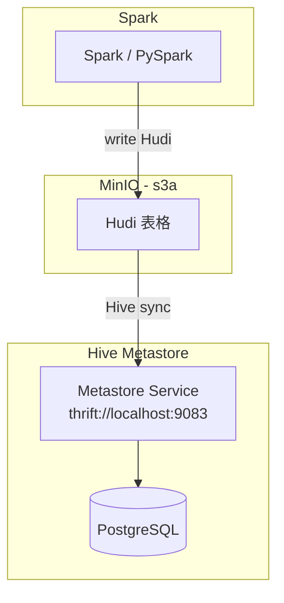

# 🍎 macOS M3 本地 Apache Spark + Hudi + Hive Metastore + MinIO 練習環境

適用於 Macbook Pro M3 架設本地練習用 Data Lake 環境，
可使用 Spark 寫入 Hudi 至 MinIO，並同步 Hive Metastore。

---

## ✅ 架構說明

```text
[Spark / PySpark]
     |
     | write Hudi table (s3a)
     v
[MinIO - S3A]  <------->  [Hive Metastore - thrift://localhost:9083]
                        |
                        v
                 [PostgreSQL Metadata]
```

## 📊 架構圖（Spark + Hudi + MinIO + Hive Metastore）



> 💡 架構總結：Spark 寫入 Hudi 表格至 MinIO，並透過 HMS (Hive Metastore Service) 同步 metadata 至 PostgreSQL。


---

## 🔧 安裝需求

- Podman / podman-compose（透過 `brew install` 安裝）
- 本機已安裝 Spark & PySpark
- Python >= 3.9（執行 Notebook or pyspark script）

---

## 🪜 啟動流程

### 1. 啟動容器服務

```bash
chmod +x start.sh
./start.sh
```

- MinIO: `http://localhost:9001`（帳密: minioadmin）
- Hive Metastore: `thrift://localhost:9083`
- PostgreSQL: `localhost:5432`

---

### 2. Spark 建立連線設定（PySpark / Notebook）

```python
spark = SparkSession.builder \
    .appName("Spark-Hudi") \
    .config("spark.serializer", "org.apache.spark.serializer.KryoSerializer") \
    .config("spark.sql.catalogImplementation", "hive") \
    .config("spark.hadoop.hive.metastore.uris", "thrift://localhost:9083") \
    .config("spark.hadoop.fs.s3a.endpoint", "http://localhost:9000") \
    .config("spark.hadoop.fs.s3a.access.key", "minioadmin") \
    .config("spark.hadoop.fs.s3a.secret.key", "minioadmin") \
    .config("spark.hadoop.fs.s3a.path.style.access", "true") \
    .config("spark.hadoop.fs.s3a.impl", "org.apache.hadoop.fs.s3a.S3AFileSystem") \
    .enableHiveSupport() \
    .getOrCreate()
```

---

### 3. PySpark 寫入 Hudi 範例（並同步 Hive）

```python
from pyspark.sql import Row
from pyspark.sql.functions import current_timestamp

data = [Row(id="1", name="Leonard"), Row(id="2", name="Yuki")]
df = spark.createDataFrame(data).withColumn("ts", current_timestamp())

df.write.format("hudi") \
    .option("hoodie.table.name", "demo_table") \
    .option("hoodie.datasource.write.recordkey.field", "id") \
    .option("hoodie.datasource.write.precombine.field", "ts") \
    .option("hoodie.datasource.write.operation", "insert") \
    .option("hoodie.datasource.hive_sync.enable", "true") \
    .option("hoodie.datasource.hive_sync.mode", "hms") \
    .option("hoodie.datasource.hive_sync.metastore.uris", "thrift://localhost:9083") \
    .option("hoodie.datasource.hive_sync.table", "demo_table") \
    .option("hoodie.datasource.hive_sync.database", "default") \
    .mode("overwrite") \
    .save("s3a://hudi/demo_table")
```

---


---

## 📦 podman-compose.yml

```yaml
  pyspark:
    image: bitnami/spark:3.4
    container_name: pyspark
    environment:
      - SPARK_MODE=client
    ports:
      - "4040:4040"
    command: /opt/bitnami/scripts/spark/run.sh
    volumes:
      - ./:/app
    depends_on:
      - hive-metastore

version: '3'
services:
  minio:
    image: quay.io/minio/minio
    container_name: minio
    command: server /data --console-address ":9001"
    ports:
      - "9000:9000"
      - "9001:9001"
    environment:
      MINIO_ROOT_USER: minioadmin
      MINIO_ROOT_PASSWORD: minioadmin
    volumes:
      - ./minio-data:/data

  postgres:
    image: postgres:14
    container_name: metastore_pg
    environment:
      POSTGRES_USER: hive
      POSTGRES_PASSWORD: hivepw
      POSTGRES_DB: metastore
    ports:
      - "5432:5432"
    volumes:
      - ./pgdata:/var/lib/postgresql/data

  hive-metastore:
    image: bitsondatadev/hive-metastore:3.1.3-postgresql
    container_name: hive_metastore
    depends_on:
      - postgres
    ports:
      - "9083:9083"
    environment:
      DB_DRIVER: org.postgresql.Driver
      SERVICE_JVM_HEAP: 2g
      METASTORE_DB_HOSTNAME: postgres
      METASTORE_DB_PORT: 5432
      METASTORE_DB_NAME: metastore
      METASTORE_DB_USER: hive
      METASTORE_DB_PASS: hivepw
    volumes:
      - ./hive-site.xml:/opt/hive/conf/hive-site.xml
```

> 🐳 使用前請確保 `podman-compose` 指令可用，且 `start.sh` 中正確呼叫本檔。


---

## 🚦 Podman Compose 啟動注意事項

1. ✅ **啟動順序注意**
   - 預設 `podman-compose up -d` 會自動依照 `depends_on` 啟動順序：
     - PostgreSQL → Hive Metastore → MinIO → PySpark
   - 如遇 `metastore` 啟動錯誤，請先確認 PostgreSQL 可正確啟動（port 5432）

2. 📂 **確認以下目錄/檔案已建立：**
   ```bash
   mkdir -p minio-data
   touch hive-site.xml  # 並正確填入 PostgreSQL 與 thrift 位址
   ```

3. 🔐 **MinIO 預設帳密**
   - `Access Key`: `minioadmin`
   - `Secret Key`: `minioadmin`
   - 登入網址：`http://localhost:9001`

4. 🔌 **Spark S3 設定（PySpark 容器）**
   - `s3a.endpoint`: `http://minio:9000`
   - `fs.s3a.path.style.access`: `true`

5. 🐝 **Hive Metastore thrift 設定**
   - URI: `thrift://hive_metastore:9083`
   - PostgreSQL: `jdbc:postgresql://metastore_pg:5432/metastore`
   - 若 Metastore 無法啟動請檢查：
     - PostgreSQL 是否已啟動
     - hive-site.xml 是否 mount 正確

6. 🧪 **進入 pyspark 容器測試**
   ```bash
   podman exec -it pyspark bash
   pyspark
   ```

7. 🛑 **關閉所有服務**
   ```bash
   podman-compose down
   ```

> 📝 建議初次執行先使用 `podman-compose up` 觀察 log，確保 PostgreSQL 與 Hive Metastore 正常啟動。
## 📁 專案檔案說明

| 檔案名稱            | 功能描述                             |
|---------------------|--------------------------------------|
| `podman-compose.yml`| 定義 MinIO / PostgreSQL / Hive 容器 |
| `start.sh`          | 快速啟動指令                         |
| `hive-site.xml`     | Spark 認識 Hive Metastore 設定       |
| `.gitignore`        | 忽略快取與本地資料                   |
| `pyspark_hudi_demo.py` | 寫入 Hudi 並同步 Hive 的 PySpark 範例 |

---

## 🧼 結束與清理

```bash
podman-compose down
rm -rf minio-data/ pgdata/
```

---

## 📘 備註建議

- 可手動在 MinIO Console 建立 bucket: `hudi`
- PostgreSQL 使用者: `hive / hivepw`
- Hive Metastore 預設 DB: `metastore`
- 建議用 Spark 3.2+ + Hudi 0.12+

---

> 📅 文件最後更新：{datetime.now().strftime("%Y-%m-%d %H:%M:%S")}（Leonard 使用於 macOS M3）

---

## 🛠 自訂 Hive CLI 測試容器

```dockerfile
# 簡易自定義 Hive Client 容器，可連線到 Metastore
FROM openjdk:11

RUN apt-get update && \
    apt-get install -y wget netcat && \
    wget https://downloads.apache.org/hive/hive-3.1.3/apache-hive-3.1.3-bin.tar.gz && \
    tar -xzf apache-hive-3.1.3-bin.tar.gz && \
    mv apache-hive-3.1.3-bin /opt/hive && \
    rm apache-hive-3.1.3-bin.tar.gz

ENV HIVE_HOME=/opt/hive
ENV PATH=$HIVE_HOME/bin:$PATH

WORKDIR /opt/hive
```

啟動建議：

```bash
chmod +x build.sh
./build.sh
podman run -it --rm --network host hive-client hive --service cli
```

> ☑ 可用於手動測試 Hive Metastore 是否正確啟動與同步。

---

## 🧾 hive-site.xml 範例

```xml
<?xml version="1.0"?>
<configuration>
    <property>
        <name>javax.jdo.option.ConnectionURL</name>
        <value>jdbc:postgresql://metastore_pg:5432/metastore</value>
        <description>PostgreSQL JDBC connection string</description>
    </property>
    <property>
        <name>javax.jdo.option.ConnectionDriverName</name>
        <value>org.postgresql.Driver</value>
    </property>
    <property>
        <name>javax.jdo.option.ConnectionUserName</name>
        <value>hive</value>
    </property>
    <property>
        <name>javax.jdo.option.ConnectionPassword</name>
        <value>hivepw</value>
    </property>
    <property>
        <name>datanucleus.autoCreateSchema</name>
        <value>false</value>
    </property>
    <property>
        <name>datanucleus.fixedDatastore</name>
        <value>true</value>
    </property>
    <property>
        <name>datanucleus.autoCreateTables</name>
        <value>false</value>
    </property>
    <property>
        <name>hive.metastore.uris</name>
        <value>thrift://hive_metastore:9083</value>
    </property>
</configuration>
```

---

## 🩺 容器健康檢查腳本 healthcheck.sh

```bash
#!/bin/bash

echo "🩺 Checking container health status..."

containers=(minio metastore_pg hive_metastore pyspark)

for container in "${containers[@]}"; do
  echo -n "🔍 $container: "
  podman inspect --format='{{.State.Status}}' "$container"
done

echo ""
echo "🌐 Verifying Hive Metastore port:"
nc -zv localhost 9083 || echo "❌ Hive Metastore port 9083 unreachable"

echo "🌐 Verifying PostgreSQL port:"
nc -zv localhost 5432 || echo "❌ PostgreSQL port 5432 unreachable"

echo "🌐 Verifying MinIO port:"
nc -zv localhost 9000 || echo "❌ MinIO port 9000 unreachable"
```
