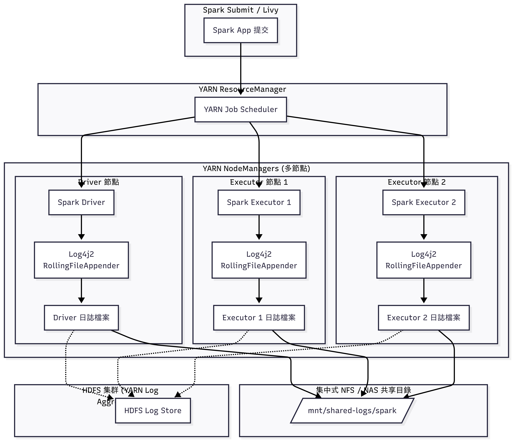

# 🔥 PySpark - Spark × Log4j2 日誌管理與集中化

*(適用於 YARN / Livy / Standalone)*

## **Spark 與 Log4j 的關係**

| 項目 | 說明 |
|------|------|
| **日誌抽象層** | Spark 使用 **SLF4J** 作為統一日誌 API。 |
| **預設日誌系統** | Spark 3.2+ 預設採用 **Log4j2**（舊版為 Log4j 1.x）。 |
| **生態一致性** | Hadoop、Hive、Kafka、HBase 都用 Log4j，Spark 可無縫整合。 |
| **用途** | 控制日誌等級、輸出格式、檔案位置、輪轉策略、集中收集。 |
| **範圍** | Spark Driver、Executor、History Server、Livy 均支援統一管理。 |

---

## **為什麼從 Log4j 升級到 Log4j2**

| 特性 | Log4j 1.x | Log4j2 | 在 Spark 的好處 |
|------|-----------|---------|------------------|
| **效能** | 同步寫入，效能低 | **LMAX Disruptor (RingBuffer)**，效能快 **10 倍** | Executor 大量寫 log 不阻塞 |
| **AsyncAppender** | 效率低 | **原生高效 AsyncAppender** | 高併發 ETL/Streaming 任務更穩定 |
| **JSON 支援** | 幾乎無 | **原生 JsonLayout** | 適合集中式日誌收集 |
| **動態調整等級** | 不支援 | **支援熱更新** | Spark UI 或 REST API 即時切換 log level |
| **安全性** | 已停止維護 | **持續更新** | 避免 **Log4Shell** 類漏洞 |
| **多 Appender** | 限制較多 | 支援 Console、File、JSON、Socket | 同時輸出多份日誌 |
| **適用性** | 小型應用 | **分散式叢集友善** | Executor 多時效能佳 |

> **總結**  
- Spark 3.2+ 預設使用 **Log4j2**，更安全、更高效，也避免手動替換相依性問題。  
- 若仍在使用 Spark 2.x（Log4j 1.x），建議升級 Spark 或替換為 Log4j2。

---

## **Log4j2 核心概念**

| 元件 | 功能 | 範例 |
|------|------|----------------|
| **Logger** | 程式中呼叫 log API | `logger.info("message")` |
| **Appender** | 決定日誌輸出到哪裡 | Console / File / JSON |
| **Layout** | 控制日誌格式 | `%d{yyyy-MM-dd HH:mm:ss} %-5p %c{1} - %m%n` |
| **Configuration** | 控制 Logger、Appender、策略 | `log4j2.properties` |

**常見 Log Level：**
```
TRACE < DEBUG < INFO < WARN < ERROR < FATAL
```
- 建議：
    - **Prod** → `rootLogger = WARN`
    - **Dev** → `rootLogger = INFO`

---

## **Log4j2 設定**

`/etc/spark/log4j2.properties`
```properties
status = WARN
name = SparkLog4j2
property.logDir = ${sys:spark.yarn.app.container.log.dir:-/var/log/spark}
property.logName = ${sys:logfile.name:-spark-app}
property.pattern = %d{yyyy-MM-dd HH:mm:ss.SSS} %-5level %c{1} - %msg%n

# Console Appender（Dev 可用）
appender.console.type = Console
appender.console.name = CONSOLE
appender.console.layout.type = PatternLayout
appender.console.layout.pattern = ${pattern}

# Rolling File Appender
appender.rolling.type = RollingFile
appender.rolling.name = ROLLING
appender.rolling.fileName = ${logDir}/${logName}.log
appender.rolling.filePattern = ${logDir}/${logName}.%d{yyyy-MM-dd}.%i.log.gz
appender.rolling.layout.type = PatternLayout
appender.rolling.layout.pattern = ${pattern}
appender.rolling.policies.type = Policies
appender.rolling.policies.time.type = TimeBasedTriggeringPolicy
appender.rolling.policies.time.interval = 1
appender.rolling.policies.size.type = SizeBasedTriggeringPolicy
appender.rolling.policies.size.size = 512MB
appender.rolling.strategy.type = DefaultRolloverStrategy
appender.rolling.strategy.max = 7

# Async Appender（建議 Prod 開啟）
appender.asyncText.type = Async
appender.asyncText.name = ASYNC_TEXT
appender.asyncText.appenderRef.ref = ROLLING

# Root Logger
rootLogger.level = WARN
rootLogger.appenderRefs = consoleRef, rollingRef
rootLogger.appenderRef.consoleRef.ref = CONSOLE
rootLogger.appenderRef.rollingRef.ref = ASYNC_TEXT

# Parquet、Jetty、Hive
logger.parquet.name = org.apache.parquet
logger.parquet.level = ERROR
logger.jetty.name = org.spark_project.jetty
logger.jetty.level = WARN
logger.hive.name = org.apache.hadoop.hive.metastore.RetryingHMSHandler
logger.hive.level = FATAL

# Custom Application logger
logger.app.name = com.example.spark
logger.app.level = INFO
logger.app.additivity = false
logger.app.appenderRefs = appConsole, appFile
logger.app.appenderRef.appConsole.ref = CONSOLE
logger.app.appenderRef.appFile.ref = ASYNC_TEXT
```

---

## **YARN 環境集中日誌方案**

在 **Spark on YARN** 模式下，Driver / Executor 分散在不同節點，預設日誌分散於：
```
/var/log/hadoop-yarn/container/<app_id>/stdout
/var/log/hadoop-yarn/container/<app_id>/stderr
```

---

### **方案 1：YARN Log Aggregation（最簡單）**
> 適合中小型叢集，無需額外安裝。

#### **設定步驟**
在 `yarn-site.xml` 啟用：
```xml
<property>
  <name>yarn.log-aggregation-enable</name>
  <value>true</value>
</property>

<!-- 保留 7 天日誌 -->
<property>
  <name>yarn.log-aggregation.retain-seconds</name>
  <value>604800</value>
</property>
```

#### **查詢日誌**
```bash
yarn logs -applicationId <app_id>
```

#### **優點**
- YARN 原生功能，無需額外元件。
- Driver / Executor 日誌會集中到 **HDFS**。
- 適合任務結束後查看完整日誌。

#### **缺點**
- 查詢需透過 CLI，無即時監控。
- 無全文檢索，僅適合單次排錯。

---

### **方案 2：Log4j2 Rolling + NFS（共享檔案系統）**
> 適合已有 NAS / NFS ，並希望即時集中日誌。

#### **設定步驟**
1. **設定 Log4j2 輸出目錄**
```properties
property.logDir = /mnt/shared-logs/spark
property.logName = ${sys:logfile.name:-spark-app}
appender.rolling.fileName = ${logDir}/${logName}.log
```
2. **spark-submit 指定不同檔名**
```bash
spark-submit   --master yarn   --conf "spark.driver.extraJavaOptions=-Dlogfile.name=myjob-driver"   --conf "spark.executor.extraJavaOptions=-Dlogfile.name=myjob-exec"
```

#### **優點**
- 所有日誌集中到 `/mnt/shared-logs/spark`。
- 可直接 `tail -f`、`grep` 即時查 Driver / Executor log。
- 成本低，部署簡單。

#### **缺點**
- 需要共享檔案系統。
- 過載時可能影響 Executor 寫入效能。

>請確保 /mnt/shared-logs/spark 有正確的讀寫權限，否則 Executor 可能無法寫入日誌。
---

## **Spark on YARN + Log4j2 Logging**



---

## **總結與建議**

- Spark Prod 環境請升級到 **Log4j2 (≥ 2.17)**。
- 統一路徑 `/var/log/spark` 或 `/mnt/shared-logs/spark` → Driver、Executor 日誌統一管理。
- **低預算最佳方案**：
    1. **YARN Log Aggregation** → 集中到 HDFS。
    2. **Log4j2 Rolling + NFS** → 即時查看日誌。
- 兩種方案可 **同時啟用**，兼顧即時監控與日誌歸檔。

---

## **Reference**

|  |  |
|------|------|
| Apache Spark 官方 | https://spark.apache.org/docs/latest/ |
| Spark Logging | https://spark.apache.org/docs/latest/configuration.html#spark-logging |
| Log4j2 & Config | https://logging.apache.org/log4j/2.x/manual/configuration.html |
| Spark on YARN | https://spark.apache.org/docs/latest/running-on-yarn.html |
