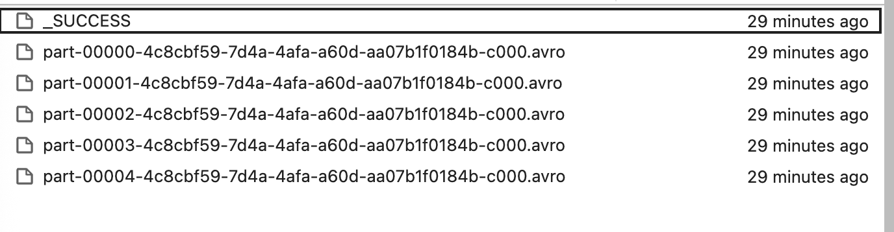
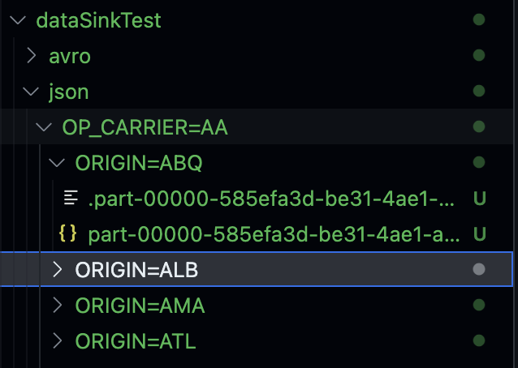

# PySpark - DataFrame Writer 與 Partition Example

## Overview
| 參數/方法 | 作用 | 對輸出檔案數 | 對Folder結構 | 對後續查詢效能 | 典型用途 |
|---|---|---:|---|---|---|
| `repartition(N)` | 重新Partition（隨機） | **控制**（≈N 檔） | 無影響 | 無直接幫助 | 控制檔案數/平衡分工 |
| `partitionBy(cols…)` | 依欄位值分Folder | 視Partition值而定 | **建立 `col=value/`** | **強：Partition Pruning** | 時間序列、維度篩選 |
| `bucketBy(B, cols…)`* | Hash 分桶（表級） | 視Bucket數與計算而定 | 無（表內邏輯分桶） | **中～強：Join/GroupBy 減少 Shuffle** | 大表 Join/聚合 |
| `sortBy(cols…)`* | Bucket/Partition內排序 | 無 | 無 | **加速Bucket內掃描** | 時序檢索、範圍查詢 |
| `option("maxRecordsPerFile", N)` | 每檔上限筆數 | **切檔**（≤N/檔） | 無 | 無直接幫助 | 避免小檔/巨檔 |
\* `bucketBy/sortBy` **只對 `saveAsTable` 生效**，`save(path)` 無效。

---

## Folder & Bucket
```
# partitionBy 之後的 Folder
/data/out/ds=2025-09-07/part-0000.parquet
/data/out/ds=2025-09-08/part-0001.parquet

# bucketBy 作用在「表」：沒有 Folder Layer變化，但在 Metastore 中記錄「Bucket」資訊
db.bucketed_events  --(16 buckets on user_id, sorted by event_ts)
```

---

## 常見組合與輸出效果

### 控制檔案數
```python
(df.repartition(32)                       # 控制輸出 ≈ 32 檔
   .write.option("maxRecordsPerFile", 2000000)
   .parquet("/data/out"))
```
- **檔案數**：≈ 32～(更多，若每檔超過 N 筆會再切)
- **效能**：無Partition修剪；單純控顆粒。

---

### 時間序列查詢（最佳實踐）
```python
(df.write
   .partitionBy("ds")                     # 以日期分Folder
   .option("maxRecordsPerFile", 2_000_000)
   .mode("append")
   .parquet("/lake/sales"))
```
- **Folder**：`/lake/sales/ds=YYYY-MM-DD/...`
- **查詢**：`WHERE ds='2025-09-07'` 只掃該日期Partition → **快**

---

### 大表 Join/GroupBy（OLAP 場景）
```python
(df.write
   .mode("overwrite")
   .bucketBy(32, "user_id")               # Table Level Hash 分桶
   .sortBy("event_ts")
   .saveAsTable("warehouse.bucketed_events"))
```
- **效果**：與另一張同Bucket數、同 key 的表 Join → **顯著減少 Shuffle**
- **限制**：僅 `saveAsTable`；Bucket數固定，改變需重寫表。

---

### 只覆蓋指定Partition（防止整體覆蓋）
```python
spark.conf.set("spark.sql.sources.partitionOverwriteMode", "dynamic")

(df.filter("ds='2025-09-07'")
   .write.partitionBy("ds")
   .mode("overwrite")
   .parquet("/lake/sales"))
```
- **結果**：只覆蓋 `ds=2025-09-07` Partition，不動其他日期。

---

## 參數調整建議
| 需求 | 推薦做法 | 備註 |
|---|---|---|
| 減少小檔/控制檔案數 | `repartition(N)` + `maxRecordsPerFile` | N 取決於叢集/資料量 |
| 篩選為主（日期/區域） | `partitionBy("ds", "region")` | 控制Partition欄位基數，避免爆量Folder |
| 大表頻繁 Join/GroupBy | `bucketBy(B, key)`（+ `sortBy`） | 只用 `saveAsTable`；雙表Bucket數/鍵一致 |
| 時序掃描還要快 | `partitionBy("ds")` + 合理檔案大小 | 搭配下游查詢條件一致 |
| 嚴格控制覆蓋範圍 | `partitionOverwriteMode=dynamic` | 只覆蓋寫入到的Partition |

---

## 注意事項
- `bucketBy/sortBy` **對 `save(path)` 無效**；必須 `saveAsTable`（Hive/Glue/Spark Catalog）。  
- `overwrite` 在Partition資料集上若**未**設定 `partitionOverwriteMode=dynamic`，可能把整個目標路徑覆蓋掉。  
- `partitionBy` 選高基數欄位（如 user_id）會導致**Partition爆炸**與大量小檔案。  
- `repartition` 會 Shuffle；在超大資料集上要留意成本。  
- `maxRecordsPerFile` 只控制「每檔筆數」，不控制「檔案大小」；不同格式/壓縮比會有差異。  

---

## 範例
範例資料集為 Udemy 課程中提供的航班時間資料集

- 設定與讀取 Source Data
```python
from pyspark.sql import *
from pyspark.sql.functions import spark_partition_id

from lib.logger import Log4j

# 如使用到 avro 記得要去官方下載並確認對應版本
# 筆者使用 Scala 2.13, spark 3.4.3
spark = SparkSession \
    .builder \
    .master("local[3]") \
    .appName("SparkSchemaDemo") \
    .config("spark.jars", "/Users/squid504s/leonard_github/PySpark-Capstone/packages/spark-avro_2.13-3.4.3.jar") \
    .getOrCreate()

logger = Log4j(spark)

flightTimeParquetDF = spark.read \
    .format("parquet") \
    .load("dataSource/flight*.parquet")
```

- Default 情況 無 Repartition / 無 PartitionBy
  - 預設情況下 → 單一分區
  - 寫出時只會產生 1 個檔案
  - 查詢時無法進行分區修剪 → 效能較差
```python
logger.info("Num Partitions before: " + str(flightTimeParquetDF.rdd.getNumPartitions()))
flightTimeParquetDF.groupBy(spark_partition_id()).count().show()

Result:
+--------------------+------+
|SPARK_PARTITION_ID()| count|
+--------------------+------+
|                   0|470477|
+--------------------+------+
```

- 使用 .repartition(5) → 控制輸出檔案數
  - 產生了 5 個 Avro 檔案
  - 但這只是 隨機重新分配資料 → 不會產生實體 Partition Folder
  - 查詢時仍需掃描所有檔案，效能沒優化
```python
partitionedDF = flightTimeParquetDF.repartition(5)
logger.info("Num Partitions after: " + str(partitionedDF.rdd.getNumPartitions()))
partitionedDF.groupBy(spark_partition_id()).count().show()

+--------------------+-----+
|SPARK_PARTITION_ID()|count|
+--------------------+-----+
|                   0|94096|
|                   1|94095|
|                   2|94095|
|                   3|94095|
|                   4|94096|
+--------------------+-----+
```
```
partitionedDF.write \
    .format("avro") \
    .mode("overwrite") \
    .option("path", "/Users/squid504s/leonard_github/PySpark-Capstone/05-DataSinkDemo/dataSinkTest/avro") \
    .save()
```


- 如果想針對 航班運營商(OP_CARRIER) 與 出發地(ORIGIN) 建立實體 Partiotion，可使用 .partitionBy() 讓輸出檔案按欄位值分 Folder
  - Folder 會依照 OP_CARRIER → ORIGIN 建立階層式結構
  - 查詢時可直接針對特定運營商或出發地做 Partition Pruning → 效能大幅提升
```
flightTimeParquetDF.write \
    .format("json") \
    .mode("overwrite") \
    .option("path", "/Users/squid504s/leonard_github/PySpark-Capstone/05-DataSinkDemo/Avro_test/json/") \
    .partitionBy("OP_CARRIER", "ORIGIN") \
    .option("maxRecordsPerFile", 10000) \
    .save()

spark.stop()
```


## Reference
[spark-avro package](https://central.sonatype.com/artifact/org.apache.spark/spark-avro_2.13/3.4.3/versions)

[PySpark - Apache Spark Programming in Python for beginners](https://www.udemy.com/course/apache-spark-programming-in-python-for-beginners/)

[Apache Spark Official](https://spark.apache.org/docs/latest/)


---

---