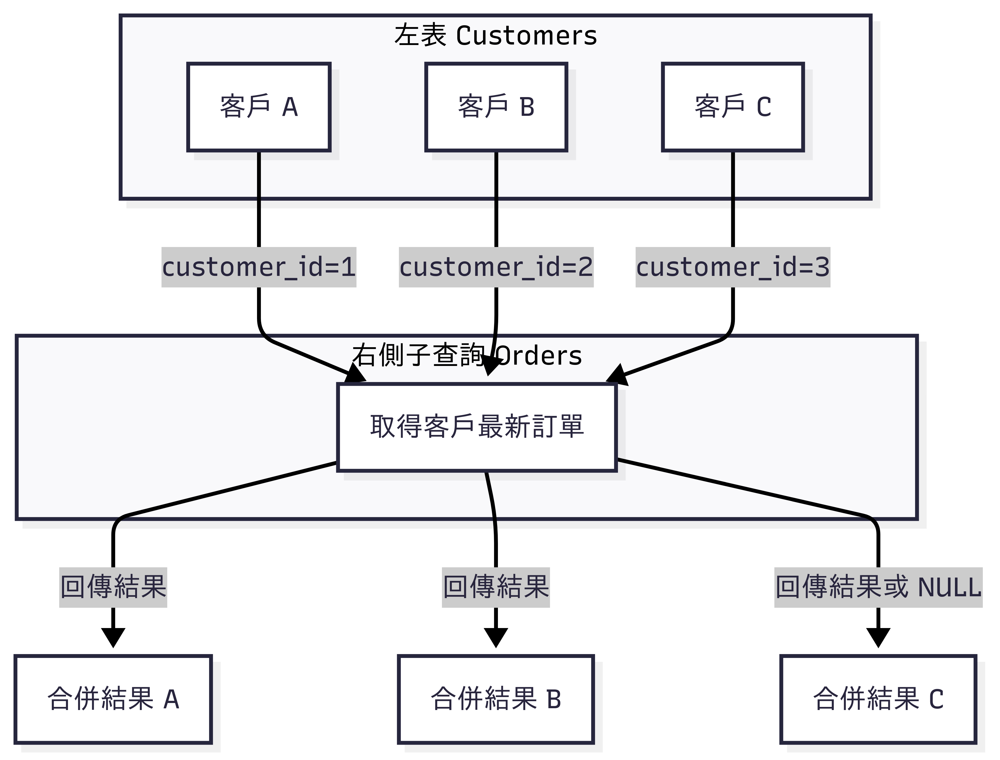

# SQL Server `APPLY` 查詢

## 資料表資訊 (SQL Server)

為了讓範例可以直接執行，我們先建立兩張表：

### **Customers 表**
| 欄位名稱       | 型別          | 說明 |
|---------------|---------------|----------------|
| customer_id   | INT (PK)      | 客戶編號 |
| name          | VARCHAR(20)  | 客戶名稱 |

### **Orders 表**
| 欄位名稱       | 型別          | 說明 |
|---------------|---------------|----------------|
| order_id      | INT (PK)      | 訂單編號 |
| customer_id   | INT (FK)      | 客戶編號 |
| order_date    | DATETIME      | 訂單日期 |
| amount        | DECIMAL(10,2) | 訂單金額 |

---

### **建立資料表**
```sql
IF OBJECT_ID('Orders', 'U') IS NOT NULL DROP TABLE Orders;
IF OBJECT_ID('Customers', 'U') IS NOT NULL DROP TABLE Customers;

CREATE TABLE Customers (
    customer_id INT PRIMARY KEY,
    name VARCHAR(100)
);

CREATE TABLE Orders (
    order_id INT PRIMARY KEY,
    customer_id INT NOT NULL FOREIGN KEY REFERENCES Customers(customer_id),
    order_date DATETIME NOT NULL,
    amount DECIMAL(10,2) NOT NULL
);
```

---

### **插入測試資料**
```sql
INSERT INTO Customers(customer_id, name) VALUES
(1, 'Alice'),
(2, 'Bob'),
(3, 'Carol');

INSERT INTO Orders(order_id, customer_id, order_date, amount) VALUES
(101, 1, '2025-08-01', 120.00),
(102, 1, '2025-08-10', 90.00),
(103, 1, '2025-08-15', 250.00),
(201, 2, '2025-07-20', 300.00),
(202, 2, '2025-08-05', 80.00);
```

---

## `APPLY` 原理

在 **SQL Server** 中，`APPLY` 是一種 **橫向關聯** (lateral join) 的機制。
- `CROSS APPLY` = 像 INNER JOIN
- `OUTER APPLY` = 像 LEFT JOIN

> **PostgreSQL 對應**：`LATERAL`

---

## `CROSS APPLY` vs `OUTER APPLY`

| 特性 | CROSS APPLY | OUTER APPLY |
|------|-----------|-------------|
| 類似於 | INNER JOIN | LEFT JOIN |
| 如果右邊沒有資料 | 不回傳該列 | 保留左邊列，右邊欄位填 NULL |
| 適用場景 | 只要右邊有結果 | 即使右邊沒有結果也要顯示 |



---

## 範例 1：每位客戶取最新一筆訂單

### CROSS APPLY
```sql
SELECT c.customer_id, c.name, o1.order_id, o1.order_date, o1.amount
FROM Customers AS c
CROSS APPLY (
    SELECT TOP (1) o.*
    FROM Orders AS o
    WHERE o.customer_id = c.customer_id
    ORDER BY o.order_date DESC
) AS o1;
```

### OUTER APPLY
```sql
SELECT c.customer_id, c.name, o1.order_id, o1.order_date, o1.amount
FROM Customers AS c
OUTER APPLY (
    SELECT TOP (1) o.*
    FROM Orders AS o
    WHERE o.customer_id = c.customer_id
    ORDER BY o.order_date DESC
) AS o1;
```

#### **預期結果比較**

**CROSS APPLY → 只顯示有訂單的客戶**
| customer_id | name | order_id | order_date | amount |
|------------|------|----------|------------|--------|
| 1 | Alice | 103 | 2025-08-15 | 250.00 |
| 2 | Bob   | 202 | 2025-08-05 | 80.00 |

**OUTER APPLY → 保留所有客戶**
| customer_id | name | order_id | order_date | amount |
|------------|------|----------|------------|--------|
| 1 | Alice | 103 | 2025-08-15 | 250.00 |
| 2 | Bob   | 202 | 2025-08-05 | 80.00 |
| 3 | Carol | NULL | NULL | NULL |

---

## 範例 2：每位客戶取金額最高前三筆訂單

```sql
SELECT c.customer_id, c.name, d.order_id, d.order_date, d.amount
FROM Customers AS c
OUTER APPLY (
    SELECT TOP (3) o.*
    FROM Orders o
    WHERE o.customer_id = c.customer_id
    ORDER BY o.amount DESC
) d
ORDER BY c.customer_id, d.amount DESC NULLS LAST;
```

**預期結果**
| customer_id | name | order_id | order_date | amount |
|------------|------|----------|------------|--------|
| 1 | Alice | 103 | 2025-08-15 | 250.00 |
| 1 | Alice | 101 | 2025-08-01 | 120.00 |
| 1 | Alice | 102 | 2025-08-10 | 90.00 |
| 2 | Bob   | 201 | 2025-07-20 | 300.00 |
| 2 | Bob   | 202 | 2025-08-05 | 80.00 |
| 3 | Carol | NULL | NULL | NULL |

---

## 7. 效能注意事項

- `APPLY` 會針對左表每列執行一次子查詢
- 建議建立複合索引：
```sql
CREATE INDEX idx_orders_customer_date
ON Orders(customer_id, order_date DESC);
```
- CROSS APPLY 稍快於 OUTER APPLY

## Reference
[理解 SQL Server 的 CROSS APPLY 和 OUTER APPLY 査詢](https://www.navicat.com/cht/company/aboutus/blog/1824-understanding-sql-server-cross-apply-and-outer-apply-queries-part-1.html)

---

最近打拳被揍到腦袋有點不靈光 🤕  
寫文章需要咖啡來補血 ☕  
如果你喜歡這篇內容，歡迎請我喝杯咖啡！  

Lately I’ve been punched a bit too much in boxing 🥊  
My brain runs on coffee patches ☕  
If you enjoyed this post, fuel me with a cup!  

👉 [Buy Me a Coffee](https://buymeacoffee.com/james604s)

---