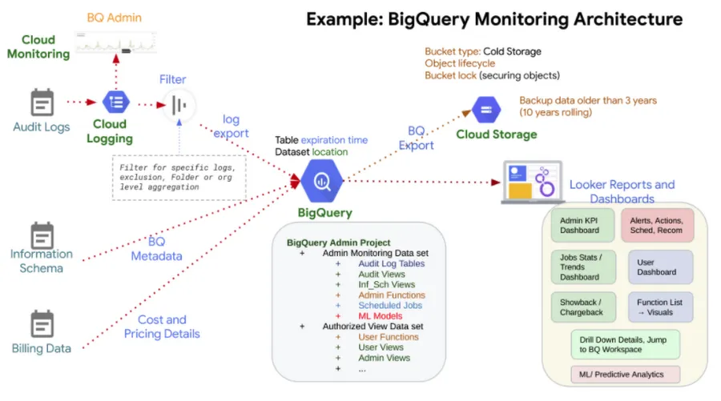
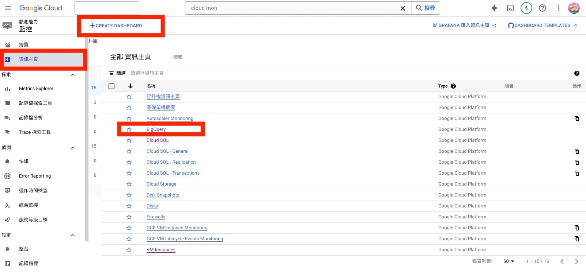
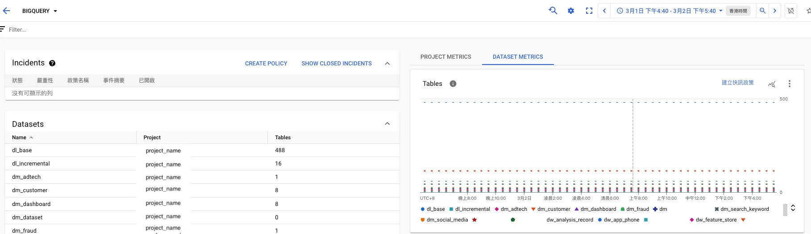
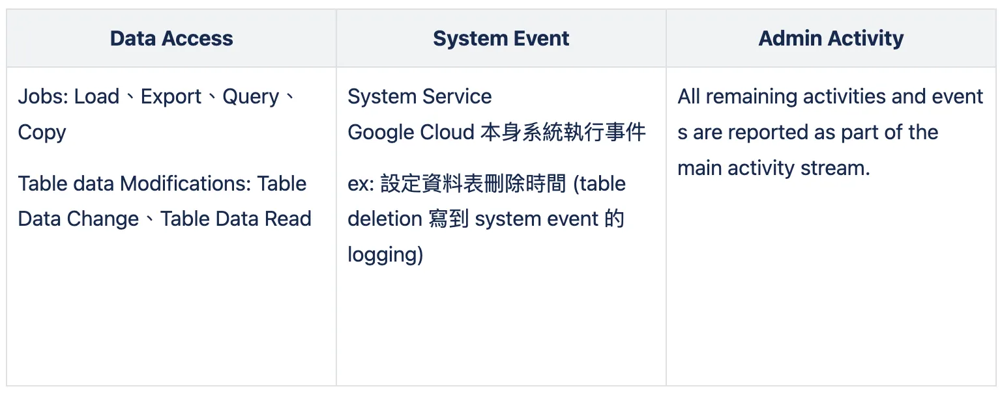
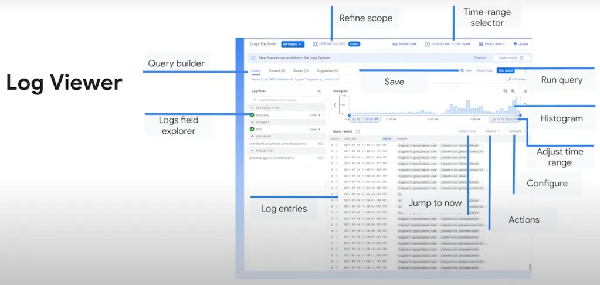
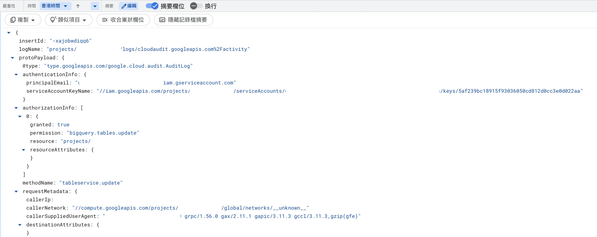
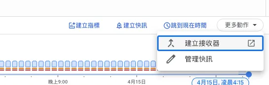
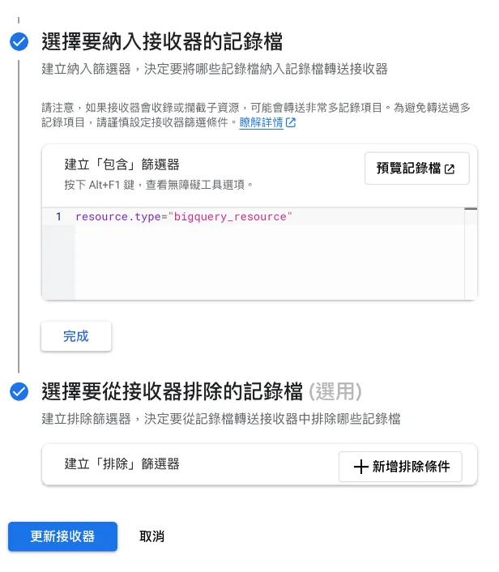
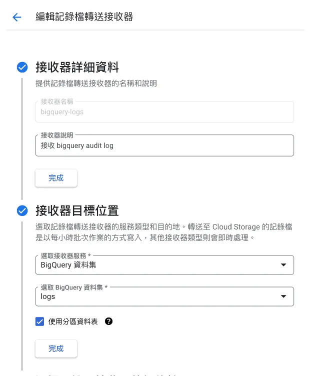
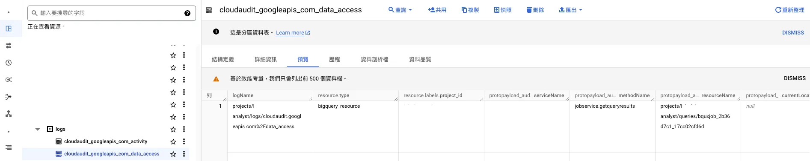

從我的 Medium 文章轉發: [BigQuery Logging & Monitor
](https://medium.com/sq-catch-and-note/bigquery-logging-monitor-84892efb3376)



Google Cloud Logging、Monitoring 和 Alerting 能確保 BigQuery 工作負載可靠運行、優化性能和控制成本的關鍵工具。  
根據 Google Cloud 文件以下可以讓監控優化更多應用面向。

Cloud Monitoring 查看 BigQuery 指標
INFORMATION_SCHEMA views 查看關於 jobs, datasets, tables, reservations 的 metadata
Audit Logs 查看各種 Event 像是 (create/delete a table, purchase slots, run jobs)

## Cloud Monitoring
具備以下的功能:

- 建立儀表板、視覺化圖表
- 異常的查詢的告警 (ex: 使用者查詢量過大)
- 分析歷史效能、分析查詢量
### Dashboard 基本範例
- Dashboard Page
- Table 大小總覽
- Dataset 大小總覽



## Cloud Logging
### Cloud Audit Logs

- 管理各種事件，像是 Table 的 CRUD。
- 使用者查詢儲存的數據。
- 系統生成的系統事件。
### Log Viewer

- LogEntry Objects
可以透過撈取 Logging 資訊作為主動告警

- GCP Service Account 使用 BigQuery 查詢量撈取範例
```
resource.type="bigquery_resource"
log_name="projects/<project_id>/logs/cloudaudit.googleapis.com%2Fdata_access"
protoPayload.methodName="jobservice.jobcompleted"
protoPayload.serviceData.jobCompletedEvent.job.jobStatistics.totalProcessedBytes > 75000000000
protoPayload.authenticationInfo.principalEmail=~"(iam\.gserviceaccount\.com)$" 
```
- GCP Schedule Query 撈取 Error 範例
```
resource.type="bigquery_resource"
log_name="projects/<project_id>/logs/cloudaudit.googleapis.com%2Fdata_access"
protoPayload.serviceData.jobCompletedEvent.job.jobName.jobId=~"scheduled_query"
severity=ERROR
```
以上撈取出來的可以去做客製化指標並使用 Cloud Alert 告警到 Slack 或是其他通訊軟體。
### Log export to bigquery
可以匯出至 BigQuery 做被動監控報表，並且針對歷史資料做分析。
- 有時候 Log Viewer 上較難以閱讀及使用, 可以透過 SQL 的方式查詢。
- Audit log 預設保留 30 天，可以將 Log 匯出並針對歷史資料做查詢。
- Audit log 匯出時記得設定過濾，避免量過大。 

**Step:**
- BQ 建立資料集
- Logging 建立接收器  




**BigQuery Logging Table:**



## Reference:
[Google Cloud OnBoard: 開始建構企業資料倉儲](https://cloudonair.withgoogle.com/events/taiwan-cloud-onboard-architecting-data-warehouse-2022)  
[INFORMATION SCHEMA Intro](https://cloud.google.com/bigquery/docs/information-schema-intro)  
[BigQuery Audit Log](https://cloud.google.com/bigquery/docs/introduction-audit-workloads)  
[BigQuery 的三種監控方式 – 匯出 Cloud Logging](https://ithelp.ithome.com.tw/m/articles/10308217)

— — — — — — — — — — — — — — — — — — —

這是一個由 Gemini Advanced 產生的 Summary

1. Logging (日誌記錄)
詳細記錄操作歷史： BigQuery 日誌會詳細記錄各種操作，如查詢執行、資料載入、表格建立等。這有助於追蹤作業歷史、調查錯誤原因，並滿足合規審計需求。
深入了解系統行為： 透過分析日誌，您可以深入了解 BigQuery 的運行狀況，識別潛在問題，並優化查詢性能。
長期數據存儲： 日誌可以長期存儲，供未來分析和審計使用。

2. Monitoring (監控)
實時系統狀態可視化： 監控提供 BigQuery 關鍵指標的實時可視化，如查詢執行時間、槽位使用率、查詢成本等。這有助於及時發現性能瓶頸和異常情況。
趨勢分析與容量規劃： 透過分析歷史監控數據，您可以了解 BigQuery 使用趨勢，預測未來需求，並相應地規劃容量。
主動問題識別： 監控可以幫助您在問題影響用戶之前主動識別並解決。

3. Alerting (警報)
及時通知異常情況： 當 BigQuery 指標超過預設閾值時，警報會及時通知相關人員，以便立即採取行動。
成本控制： 警報可以幫助您監控查詢成本，避免意外的高額費用。
綜上所述，BigQuery Logging、Monitoring 和 Alerting 對於以下方面至關重要：

4. 優化性能： 識別性能瓶頸，優化查詢和工作負載。
控制成本： 監控和管理查詢成本，避免意外費用。
滿足合規需求： 記錄操作歷史，滿足審計和合規要求。
透過有效利用這些工具，您可以全面管理 BigQuery 環境，確保其高效、可靠地運行，並充分發揮其強大的數據分析能力。